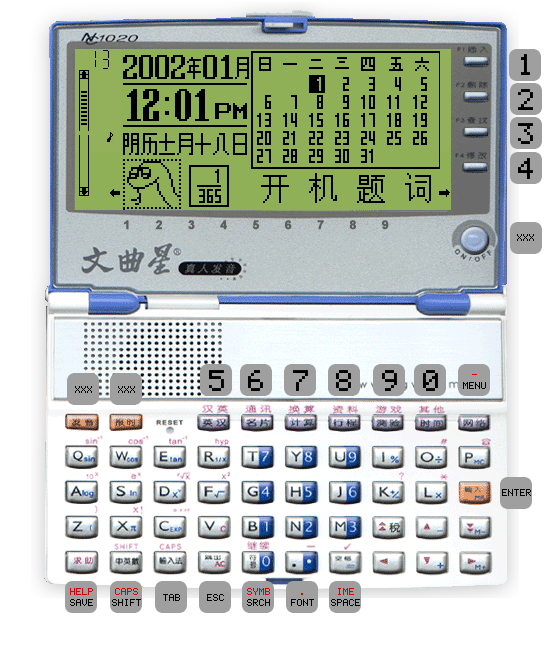

# GGV NC1020 emulator for Besta RTOS (Arm)

"Closed system no game" my a$$. /s

## Details

This is a port of the ["cross-platform" version of NC1020 emulator](https://github.com/Wang-Yue/NC1020), originally developed by Wang-Yue (which is based on some Chinese code of unknown origin). I made it even more cross-platform by introducing a HAL layer that handles page I/O, and wrote a HAL implementation targeting the toolchain I developed for Besta RTOS. When the emulator is built in release mode, it can manage about 50% speed on weaker Arm7-based machines like BA110 and more than 100% on powerful machines like BA742.

In the future, I may also branch off the NC1020 emulator used here into a standalone library (à la TamaLIB) so it can be easily ported to even more platforms, potentially including bare-metal targets.

## Notes on the ROM format

This port uses a simplified, slightly different ROM format than the typical one used by the official emulator and most 3rd-party emulators. They can be generated with the included script under `scripts/gen_simplified.py` from official emulator ROM files.

## Key binding

### Note

- Trivial keys (i.e. alphabets, page up/down and arrow keys) are not explicitly labeled.
- Keys labeled as `XXX` are currently unmapped.
- The `MENU` key is the **function** menu key (usually labeled as `功能` or roman numeral `I`). Not to be confused with the home menu key (usually labeled as just `Menu` or `目录`).
- To save and quit the emulator, press and hold the home menu key mentioned above.
- `SYMB`/`SRCH` is an abbreviation of `Symbol` (`符号`)/`Search`.
